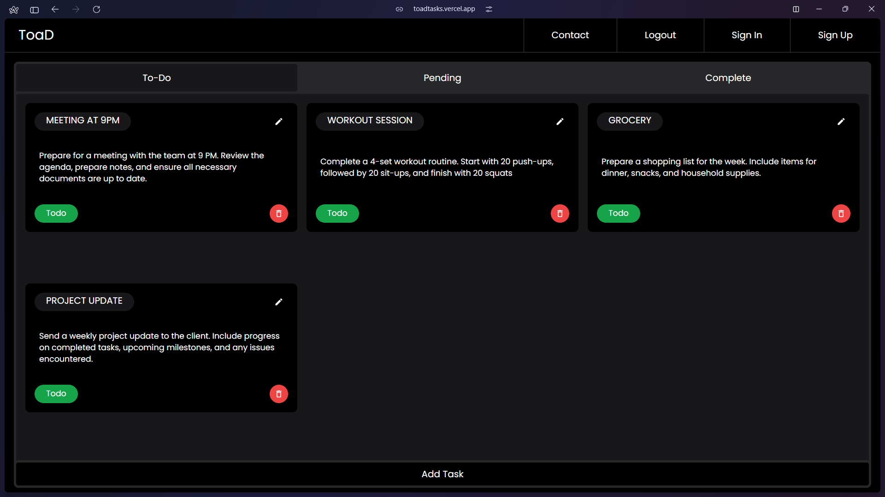

# Toad: Task Management Made Easy

Toad is a modern task management application built with Next.js 14 and MongoDB, designed to streamline your workflow and boost productivity. It's hosted at [toadtasks.vercel.app](https://toadtasks.vercel.app), offering a seamless and efficient experience for managing tasks.

## Features

- **Task Management**: Create, update, and delete tasks efficiently.
- **MongoDB Integration**: Secure and scalable data storage for your tasks.
- **Next.js 14**: Leverage the latest features of Next.js for a fast, scalable web application.
- **Middleware for Database Connection**: Securely manage database connections.

## Getting Started

1. **Create an Account**: Visit [toadtasks.vercel.app](https://toadtasks.vercel.app) and sign up for a new account.
2. **Manage Your Tasks**: Once logged in, you can start creating, updating, and deleting tasks to manage your workflow efficiently.

## Why Choose Toad?

Toad is designed to cater to the needs of task-oriented individuals. Its integration with MongoDB ensures that your data is stored securely and efficiently, while the use of Next.js 14 provides a fast and responsive user experience. The application's architecture, built with Next.js 14 and MongoDB, offers a robust solution for client-side data fetching and manipulation. Whether you're managing a project, planning your day, or simply jotting down ideas, Toad offers a comprehensive solution for task management.

Visit [toadtasks.vercel.app](https://toadtasks.vercel.app) to start using Toad today and experience the difference in task management.

*Image showcasing the Toad website interface, highlighting its modern design and user-friendly task management features.*
